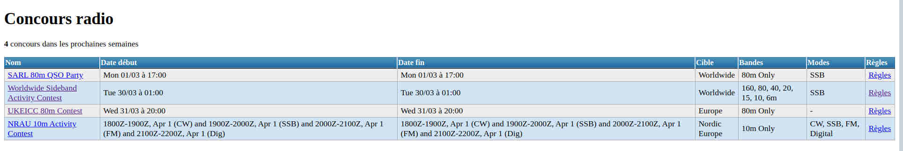

# WA7BNM-rss-gui

Small script to parse RSS feed from [https://www.contestcalendar.com/calendar.rss](#%20WA7BNM-rss-gui%20%20Small%20script%20to%20parse%20RSS%20feed%20from%20https://www.contestcalendar.com/calendar.rss) and filter results for Europe/Worldwide and SSB.

## Usage
Run `npm install` and `node index.js`. A file `contest.json` is created. 
You can use the PHP page `ham_contest.php` to see the content.

## Screenshot


### JSON structure
```json
[
	{
		"title": "F9AA Cup, SSB",
		"link": "https://www.contestcalendar.com/contestdetails.php?ref=489",
		"content": "1200Z, Mar 13 to 1200Z, Mar 14",
		"contentSnippet": "1200Z, Mar 13 to 1200Z, Mar 14",
		"guid": "https://www.contestcalendar.com/contestdetails.php?g=00qpwpc0011315",
		"name": "F9AA Cup, SSB",
		"status": "Active",
		"geographic focus": "Worldwide",
		"participation": "Worldwide",
		"mode": "SSB",
		"bands": "80, 40, 20, 15, 10, 2m",
		"classes": ">100 W>10-100W10W",
		"exchange": "RST + Serial No.",
		"work stations": "Once per band",
		"qso points": "1 point per QSO with individual5 points per QSO with club50 points per QSO with F8URC",
		"multipliers": "(see rules)",
		"score calculation": "Total score = (total QSO points x total mults) + bonus points",
		"e-mail logs to": "concoursf9aa[at]urc[dot]asso[dot]fr",
		"mail logs to": "(none)",
		"find rules at": "http://www.site.urc.asso.fr/index.php/urchaut-6/om-6/131-trophee-f9aa",
		"cabrillo name": "F9AA-SSB",
		"cabrillo name aliases": "F9AA",
		"1200z, mar 13 to 1200z, mar 14, 2021  logs due": " 0000Z, Apr 13",
		"datesString": [
		 "1200Z, Mar 13",
		 "1200Z, Mar 14"
		],
		"dates": [
		 "2021-03-13T12:00:00.000Z",
		 "2021-03-14T12:00:00.000Z"
		],
		"dateStartString": "1200Z, Mar 13",
		"dateEndString": "1200Z, Mar 14",
		"dateStart": "2021-03-13T12:00:00.000Z",
		"dateEnd": "2021-03-14T12:00:00.000Z"
	}
]
```

